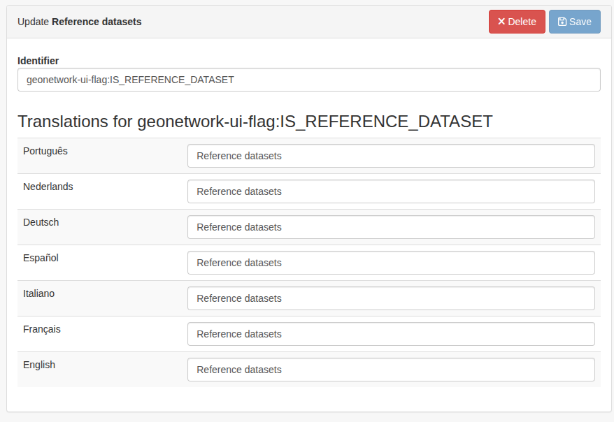

# Metadata Editor

The **Metadata Editor** application offers a user-friendly interface to create, edit, and publish metadata records.

## Features

- A dashboard showing the records available on the platform as well as searching and sorting
- A metadata edition interface allowing the modification of various parts of a record (title, abstract, keywords,
  dates...)
- Create, duplicate and delete records
- Import remote records using a URL
- Keep a draft while editing a record, with the ability to rollback to the published version and discard changes
- A simplified "light" edition page, used by other applications (e.g. the Datahub for reuses) to let users edit a record
  without the full editor interface

## Run & deploy

> [!IMPORTANT]
> GeoNetwork version 4.2.5 or above is required for the Metadata Editor app to function normally.

The Metadata Editor application is available as a docker image or as a ZIP archive.

### Using docker

The docker image is `geonetwork/geonetwork-ui-metadata-editor`.

See the [run guide](../guide/run#with-docker) for more information.

### Using the ZIP archive

A `metadata-editor-VERSION.zip` archive is available on every GeoNetwork-UI
release: https://github.com/geonetwork/geonetwork-ui/releases

See the [run guide](../guide/run#from-the-zip-archive) for more information.

### Deployment

Please refer to the [general deploy guide](../guide/deploy.md) to learn how to deploy GeoNetwork-UI applications.

## Supported metadata schemas

The editor currently support the following schemas:

- ISO 19139
- ISO 19115-3
- DCAT-AP _(support for writing values in a record is limited for now)_

Any record written in one of those schemas can be opened and modified in the edition interface.

When a record is created it uses the preferred schema, currently ISO 19115-3.

## How it works

The Metadata Editor relies on the GeoNetwork CRUD (create/read/update/delete) API for manipulating records. The records
XML is read and modified fully in the browser to allow for a reactive experience as well as offering more possibilities
for supported schemas.

### Needed permissions

To view and edit records in the Metadata Editor, a user needs to have EDITOR rights on the group where the records are
created.

The REVIEWER rights are also needed for the publication step.

- EDITOR
- REVIEWER

## Light edition page

Opening `/light-edit/{uuid}` shows a simplified edition page for the given record, without the dashboard sidebar or page
navigation. It is used by the Datahub to edit reuse records, but any application can link to it.

The top bar offers a "leave" button and a "save" button; there is no draft handling and no separate publication step on
this page.

### URL parameters

- `redirect_on_leave` (optional): a URL-encoded absolute `http(s)` URL the user is sent back to when clicking the
  "leave" button. The calling application is responsible for building the complete URL, including the record's UUID if
  it wants the user to come back to the record's page (e.g.
  `/light-edit/{uuid}?redirect_on_leave=https%3A%2F%2Fexample.com%2Fdatahub%2Freuse%2F{uuid}`). When the parameter is
  absent or invalid, the "leave" button is not displayed.

## Marking a Dataset as "Reference Dataset"

For users with administrator privileges, an additional toggle is visible when editing a Dataset Record. This toggle
allows the user to mark the Dataset as a "Reference Dataset", thus pushing forward in search results and offering
additional features for it.

::: tip Prerequisite

The "Is Reference Dataset" information is stored in the form of what is called a "record flag". For this feature to
work, every record flag should be created in the form of a Category on the GeoNetwork administration UI.

For this specific toggle, the category to use must be called "geonetwork-ui-flag:IS_REFERENCE_DATASET". The flag name is
case-sensitive and must be exactly as specified here.

This is done on this url: `/geonetwork/srv/eng/admin.console#/classification/categories`, and it should look like this:

:::

## Multilingual support

> Still under development

## Concurrent edition

> Still under development

## Configuring the edition interface

> Still under development
