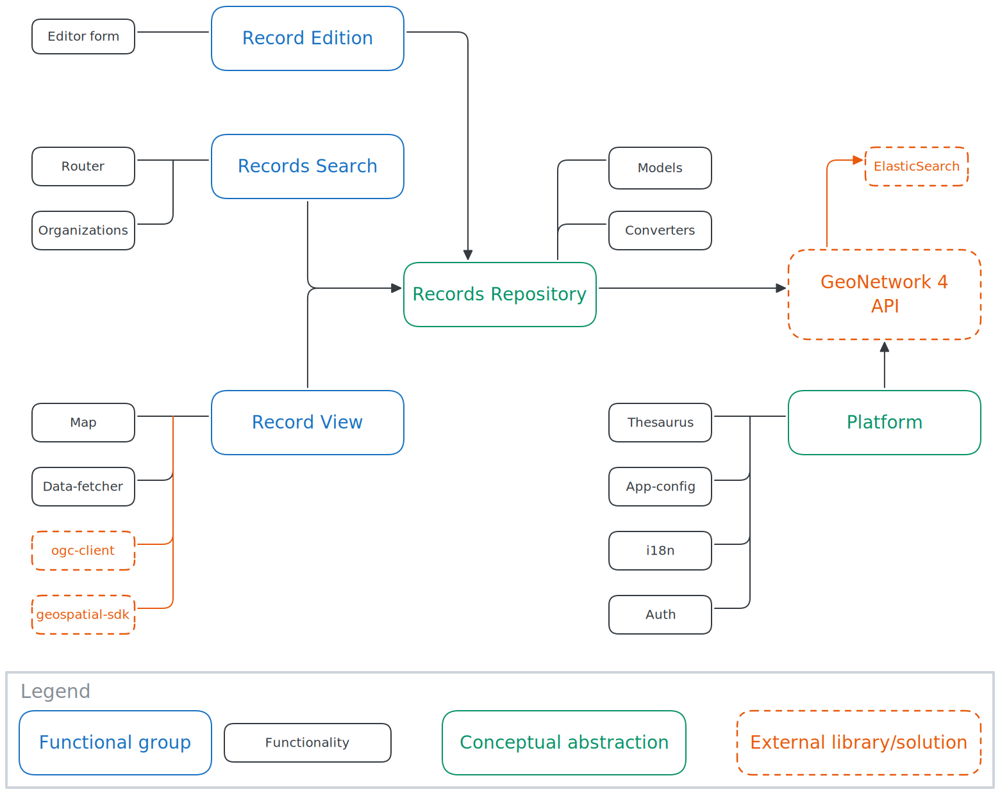

# Architecture overview

The GeoNetwork UI project is a monorepo managed using [Nx](https://nx.dev) and is composed of:

- **libraries** containing components and services in the `libs` folder
- **applications** relying on libraries in the `apps` folder
- **web components** relying on libraries in the `apps/webcomponents` folder

Other directories include:

- `assets-common`: shared assets across all apps
- `conf`: configuration-related files
- `docs`: this website
- `package`: contains the necessary toolkit for generating the [NPM package](../guide/custom-app.md)
- `support-services`: docker composition used to [set up the development environment](./dev-environment.md)
- `tools`: various tools & utils for docker, internationalization etc.
- `translations`: contains the translations of all keys used in the project

## Libraries

### Overview

This is a general diagram of how libraries are organized:

<small>[Link to original drawing](https://excalidraw.com/#json=lOWFH0YhpcR39TMXGJ010,EbT5exajYjV0zcxEU5c4nw)</small>

### Details

The libraries are organized as follows:

1. Presentation libraries are in the `ui` folder and are categorized by their forms:

   - `ui-inputs` for reusable components made to collect input from the user (e.g.: form fields, buttons...)
   - `ui-elements` for components focused on rendering specific types of information in an elaborate way, which may or may not be related to business usages;
     examples include download links, facet or selection tree, etc.
   - `ui-layout` for components which occupy a large part of the screen and might contain variable content or other components
   - `ui-map` for map-specific components (map container, controls, etc.)
   - `ui-widgets` for reusable, small, self-contained components which show information in a visual way, similar to icons but more elaborate (e.g.: icon with tooltip, status indicator, progress bar...)

   > Note: presentation components contain mainly HTML and CSS code, and should contain very little logic

2. Libraries providing business or data logic and state management are in the `feature` folder and are categorized by their intended use:

   - `feature-auth` for logic and components related to authentication
   - `feature-catalog` for logic and components related to general catalog topics (title, logo, etc.)
   - `feature-dataviz` for logic and components related to data visualization
   - `feature-record` for logic and components related to displaying a catalog record's information (metadata, data preview, exports, APIs...)
   - `feature-editor` for logic and components related to editing metadata
   - `feature-map` for logic and components related to interactive maps
   - `feature-search` for logic and components related to searching through the catalog
   - `feature-notifications` for notifications systems

   > Note: these libraries provide "smart components" which are communicating with each other using a NgRx store.  
   > They rely on presentation components and as such hold very little HTML or CSS code.

3. Libraries used for interacting with backend services are in the `data-access` folder:

   - `data-access-gn4` contains an auto-generated API client for the GeoNetwork 4 backend

4. Libraries providing various utilities in the `util` folder:

   - `util-data-fetcher` for fetching and querying datasets
   - `util-app-config` for parsing and validating application configurations
   - `util-shared` for shared models and types, test fixtures, app-wide settings etc.
   - `util-i18n` for translation and internationalization

5. Libraries providing common services or shared models are in the `util` folder:

   - `common-domain` contains many definitions used across the whole project
   - `common-fixtures` contains test fixtures

6. Libraries providing low-level functionalities that can be used both in front and backend are in the `api` folder:
   - `api-repository` for providing the Records Repository abstraction as well as all models related to it (metadata records, etc.)
   - `api-metadata-converter` for converting metadata from and to interoperable formats

### Dependency constraints

To ensure that the project structure stays healthy and avoid circular dependencies, several constraints dictating which kinds of libraries can depend on which were set up. These constraints are enforced by ESLint and configured in the [ESLint configuration file](https://github.com/geonetwork/geonetwork-ui/blob/main/.eslintrc.json).

The constraints are:

1. **No library should depend on `util/app-config`**  
   This is because only applications should decide whether an app config file should be loaded (see [this page](./app-config.md) for more information).
2. **Libraries of type `common`, `data-access` and `util` should only depend on libraries of the same type**
3. **Libraries of type `ui` and `api` should only depend on _shared libraries_ or libraries of the same type**  
   Shared libraries have the `scope:shared` tag; this is for instance the case for `util-i18n` and `util-shared`
4. **Libraries of type `feature` can depend on any other kind of library** expect `util/app-config`

## Web Components

See [the specific README file](https://github.com/geonetwork/geonetwork-ui/tree/main/apps/webcomponents/README.md).

## Applications

See [the dedicated section of this website](../apps/datahub).
